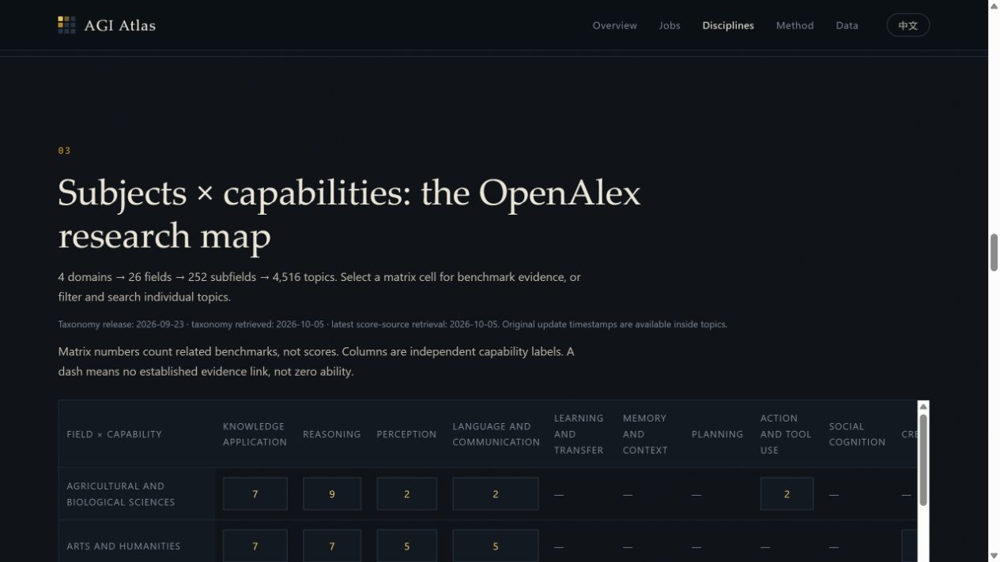

# AGI Atlas

**[Launch the live app on GitHub Pages](https://the-t800.github.io/agi-atlas/)**

**English** | [简体中文](README.zh-CN.md)

[](https://the-t800.github.io/agi-atlas/)

**How far is AI from AGI?** Explore published benchmark evidence across work, research subjects and independently annotated capabilities.

- **Subjects:** the complete OpenAlex hierarchy — **4 domains → 26 fields → 252 subfields → 4,516 topics**.
- **Capabilities:** 12 project-defined labels, independently attached to all 187 benchmarks.
- **Work:** 923 O*NET occupations and 2,087 work activities; the existing work proxy index is **0.91%**, not AGI completion.
- **Evidence:** 3,706 score records. The subject matrix counts related benchmarks; select a cell to inspect comparable results and source dates.

[Open the interactive page](https://the-t800.github.io/agi-atlas/) · [Full report](reports/report.en.md) · [Classification and provenance](docs/subject-classification.md)

## Data freshness

The taxonomy uses the **latest complete public OpenAlex release available on 2026-10-05: 2026-09-23**. It was downloaded on **2026-10-05** from the official public S3 bucket, with all four hierarchy levels, release manifests and SHA-256 hashes retained. This is a complete public release, not a claim of a complete same-day live API snapshot.

All 30 retained benchmark source URLs were refreshed on **2026-10-05**. Retrieval dates, publication dates and evaluation dates are separate. Recent task evidence highlights results evaluated (or, if unknown, published) within 365 days of taxonomy retrieval. Older and undated results remain available in score details, clearly dated or marked unknown. A new download never makes an old evaluation recent.

## How to read the subject map

Matrix cells count distinct benchmarks with a task-based subject link and capability annotation. They do not average unrelated benchmark scores. Broad exam mappings stay at field level; a combined MMLU score is never copied to every child topic. Currently 70 of 187 benchmarks have subject links, 45 have verified results, and 5 have dated results within the last year. The coverage table separates all four levels: 15 fields, 13 subfields and 10 topics have task links including descendants. Six of those topics have benchmark results; this is task evidence, not a subject score. The full 4,516-topic directory distinguishes explicit evidence, parent context and pending mappings. Unassigned benchmarks retain their capability labels.

Unmeasured topics stay **unknown**, not failed. There is **no OpenAlex mastery percentage or AGI completion percentage**. The former Nature proxy index has been retired. Official topic names and descriptions are preserved in English; domain and field labels have unofficial Chinese translations.

The O*NET work proxy retains its existing formula: best normalized benchmark score × coverage factor (direct 1.0, partial 0.5), averaged using activity importance and equal occupation weights. Missing work evidence contributes zero to that proxy only.

## Data

- Catalog: `data/research/catalog.tsv`.
- Official hierarchy: `data/denominators/openalex.json` (generated).
- Pinned original release: `data/research/sources/openalex/`.
- Capabilities: `data/taxonomy/capabilities.json`.
- Task links and evidence: `data/mappings/benchmark_openalex.tsv`.
- Scores: `data/scores/frontier_scores.yaml` (generated).

Mappings are editorial and not independently reviewed. OpenAlex organizes research literature, not all human knowledge or skills. Some benchmark results are vendor-reported. O*NET describes US occupations and is not employment-weighted.

## Quick start

Requires Python 3.12+ and [uv](https://docs.astral.sh/uv/).

```bash
uv sync --extra dev
uv run agi-atlas validate      # check data
uv run agi-atlas report        # reports/report.{zh,en}.md
uv run agi-atlas site          # docs/index.html
uv run pytest
```

Rebuild generated data (offline, from committed snapshots):

```bash
uv run python scripts/build_catalog.py
uv run python scripts/import_public_scores.py
uv run python scripts/build_models.py
uv run python scripts/build_openalex.py   # rebuild OpenAlex topics from the pinned snapshot
```

To rebuild the O*NET tables too, run `uv run python scripts/build_denominators.py`; missing O*NET source files are downloaded on the first run.

Refresh source data explicitly (normal builds and CI stay offline):

```bash
uv run python scripts/build_openalex.py --snapshot  # latest complete public release
uv run python scripts/build_openalex.py --refresh   # live API; optional OPENALEX_API_KEY
uv run python scripts/collect_sources.py --refresh  # benchmark source material
```

Then regenerate scores, models, reports and the site. Do not mix incomplete API pages into a complete release. Never commit an API key.

## Contributing

Add a benchmark, a score, or fix a mapping — see [CONTRIBUTING.md](CONTRIBUTING.md).

## License

Code: [MIT](LICENSE). Third-party data keeps its own license: O*NET (CC BY 4.0, U.S. Department of Labor), Epoch AI (CC BY 4.0), METR, papers and model cards as cited. OpenAlex data: CC0 (OurResearch). Chinese translations of O*NET and OpenAlex labels are unofficial.
